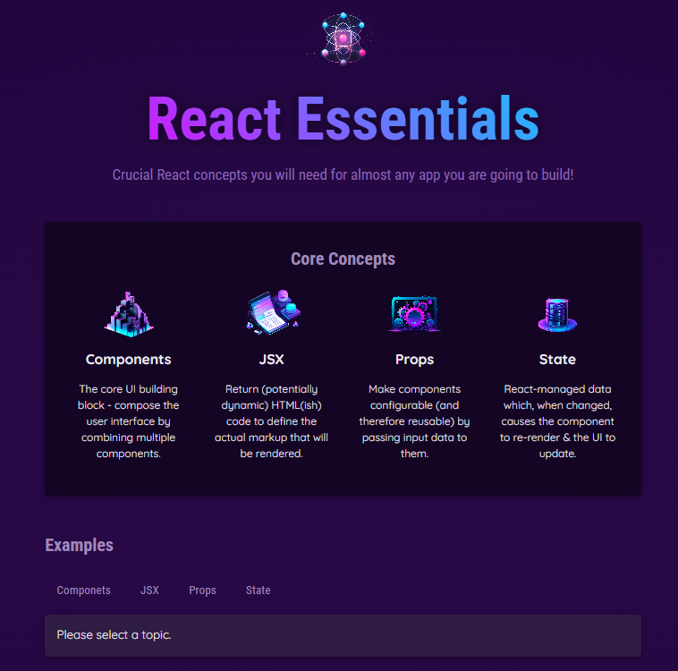

<a id="readme-top"></a>
## About The Project

The React application presents the basic concepts of the framework through interactive examples. The structure consists of two main sections:

1.  Core Concepts – a list of key concepts (components, JSX, props, state), dynamically rendered based on data from the data.js file. Each element is displayed as a separate CoreConcept component.

2.  Examples – an interactive menu with buttons (TabButton) allowing you to select a topic.

    * The selected button sets the selectedTopic state using the useState hook.
    * After selection, the content section (tab-content) displays the title, description and sample code for the topic, retrieved from the EXAMPLES object.
    * If the user does not select any topic, the application prompts with the message: ‘Please select a topic.’
4.  The whole thing creates a simple but functional educational application demonstrating the use of:
    * Functional components
    * The useState hook for state management
    * Props and dynamic list rendering
    * Conditional content rendering in React
<p align="right">(<a href="#readme-top">back to top</a>)</p>

### Page view

<p align="right">(<a href="#readme-top">back to top</a>)</p>

### Installation

1.  Clone the repository:
```bash
git clone https://github.com/USERNAME/REPOSITORY.git
cd REPOSITORY
```
2.  Install dependencies:
```bash
npm install
```
3.  Start the development server:
```bash
npm run dev
```
<p align="right">(<a href="#readme-top">back to top</a>)</p>

### Built With

This section should list any major frameworks/libraries used to bootstrap your project. Leave any add-ons/plugins for the acknowledgements section. Here are a few examples.

* Node.js
* React.js
* Vite

<p align="right">(<a href="#readme-top">back to top</a>)</p>
